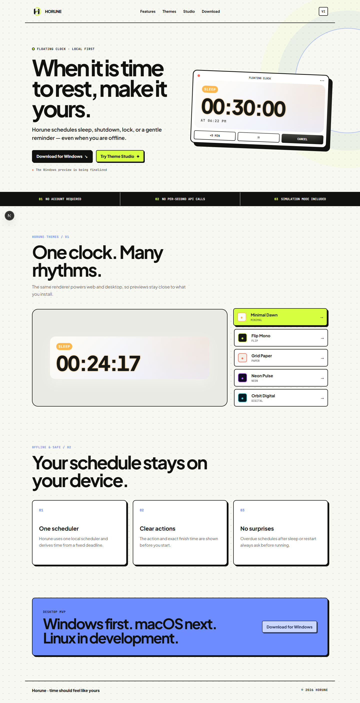
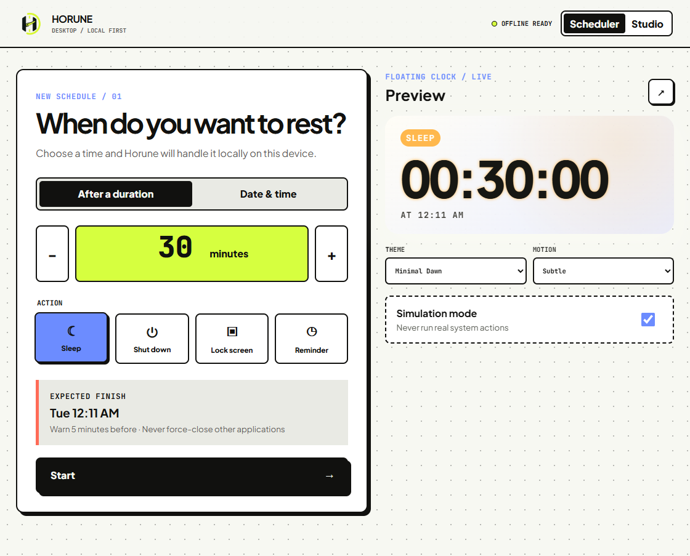
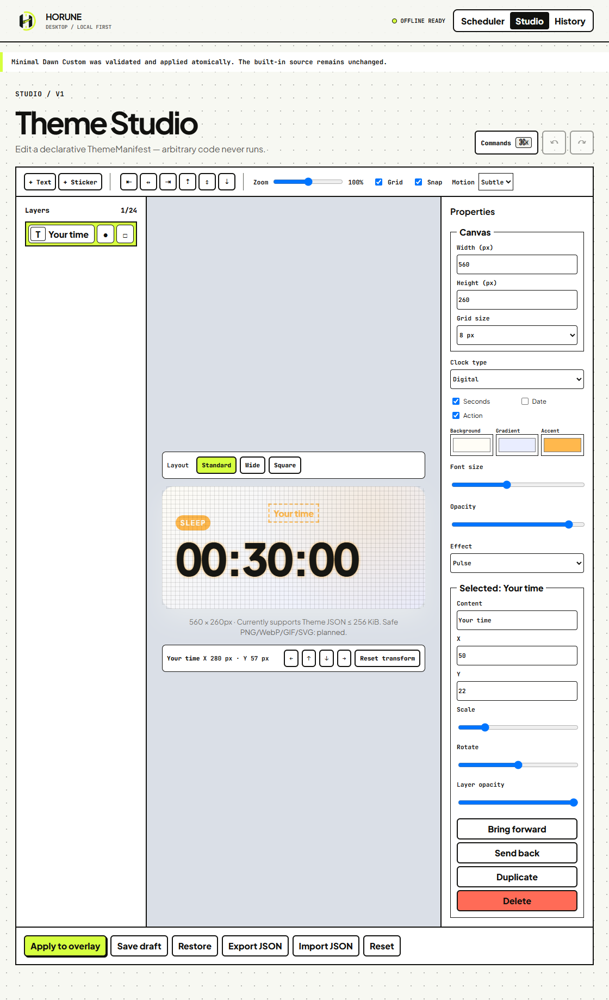

<div align="center">
  
  <p><strong>A local-first sleep timer and creative floating clock for your desktop.</strong></p>
  <p><a href="README.md">English</a> · <a href="README.vi.md">Tiếng Việt</a></p>
  <p>
    <a href="https://github.com/Ericismee/horune/actions/workflows/ci.yml"></a>
    <a href="LICENSE"></a>
  </p>
</div>

Horune schedules Sleep, shutdown, screen lock, or a reminder while showing the remaining time in a customizable floating clock. It is designed for people who want a calmer end-of-session ritual without making a network connection part of a safety-critical timer. Scheduling, persistence, recovery, and countdown calculation stay on the device; the web experience shares the same declarative theme model and renderer.

Horune is preview software. There is no downloadable release yet, real system actions have not been validated on this machine, and simulation mode is the default.

## Contents

- [Current status](#current-status)
- [Screenshots](#screenshots)
- [Features](#features)
- [Run locally](#run-locally)
- [Use Horune](#use-horune)
- [Architecture and safety](#architecture-and-safety)
- [Testing and performance](#testing-and-performance)
- [Roadmap](#roadmap)
- [Contributing and security](#contributing-and-security)
- [Author and license](#author-and-license)

## Current status

| Area                                          | Status                         | Evidence / limitation                                                                           |
| -----------------------------------------------| --------------------------------| -------------------------------------------------------------------------------------------------|
| Windows desktop UI and local scheduler source | **Available in source**        | React/Vite build and browser preview pass; Rust adapter is implemented                          |
| Windows native build                          | **Verified in CI**             | Rust tests and the NSIS bundle pass; real power actions still need hardware validation           |
| macOS native build                            | **Verified in CI / hardware unverified** | Rust tests and the DMG bundle pass; no physical Mac action test yet                    |
| Linux                                         | **Planned**                    | Reminder-only capability placeholder; no release target                                         |
| Bilingual landing (`/vi`, `/en`)              | **Available in source**        | Statically generated and tested at desktop, tablet, and mobile sizes                            |
| Theme Studio core                             | **Available in source**        | Shared web/desktop editor, renderer, draft storage, undo/redo, and validated JSON import/export |
| External image/GIF/SVG import                 | **Planned next**               | Limits and security policy are documented; no UI button claims support today                    |
| Accounts, community, sharing, and remix       | **Planned**                    | Requires the shared API milestone                                                               |
| Marketplace and payments                      | **Planned**                    | No payment or paid-entitlement logic exists in clients                                          |

“Available in source” means the feature is implemented and covered by the checks listed below; it does not mean a signed public release exists.

## Screenshots

These are Playwright captures of the running local applications, not design mockups.

| Landing page | Desktop scheduler preview |
| --- | --- |
|  |  |



The transparent native overlay is implemented, but no overlay screenshot is presented as release evidence because the host could not produce a Tauri executable. Responsive captures are available in [`docs/screenshots`](docs/screenshots).

## Features

| Feature | What works now |
| --- | --- |
| Local scheduling | Duration or exact date/time; Sleep, shutdown, lock, or reminder; warning; pause/resume; +5 minutes; cancel |
| Safe recovery | One Rust scheduler; deadlines rather than decrementing counters; overdue schedules require confirmation |
| Simulation | Enabled on first launch; automated tests never invoke a real operating-system action |
| Floating clock | Shared renderer, transparent always-on-top Tauri window, tray controls, five bundled themes |
| Theme Studio | Digital, analog, flip, word, and hybrid faces; colors and gradients; size, opacity, effect, date/seconds/action toggles |
| Layers | Add text or built-in stickers; select, drag, position, scale, rotate, hide, lock, reorder, and delete |
| Editing workflow | Zoom, grid, snap, up to 50 undo states, redo, local draft save/restore, reset, strict Theme JSON import/export |
| Motion and access | `static`, `subtle`, and `full`; reduced-motion support; visible focus; responsive web layout |

See [Theme Studio](docs/theme-studio.md) for the exact current/next/long-term boundary.

## Run locally

### Requirements

- Node.js 24 or newer
- pnpm 11
- Rust stable
- Windows: MSVC C++ Build Tools and WebView2
- macOS: Xcode command-line tools

```bash
git clone https://github.com/Ericismee/horune.git
cd horune
pnpm install
```

```bash
# Next.js landing and browser Theme Studio
pnpm dev:web

# Native Tauri desktop app
pnpm dev:desktop
```

Open `http://localhost:3000` (redirects to English), `http://localhost:3000/vi`, or the corresponding `/studio` route. There is intentionally no installer link until a real release artifact exists.

<details>
<summary>Build and test commands</summary>

```bash
pnpm typecheck
pnpm test
pnpm test:e2e
pnpm build
pnpm tauri build
```

The last command builds only for the current operating system and needs the native prerequisites listed in [development.md](docs/development.md).
</details>

### Monorepo map

```text
apps/
  desktop/              Tauri 2, React, TypeScript, Rust, SQLite
  web/                  Next.js 16 App Router
packages/
  design-system/        Shared tokens, typography, motion, focus
  theme-schema/         Strict versioned ThemeManifest validation
  theme-renderer/       Shared clock and layer renderer
  theme-studio/         Shared web/desktop editor and JSON I/O
docs/                   Architecture, security, testing, roadmap
```

## Use Horune

### Schedule a simulated Sleep in 30 minutes

1. Keep **Simulation mode** enabled.
2. Choose **After a duration**, enter `30`, and choose **Sleep**.
3. Confirm the displayed finish time, then select **Start**.
4. Use the main window, overlay, or tray to pause, add five minutes, or cancel.

If Horune returns after the deadline because of sleep, restart, exit, or a clock jump, the schedule becomes `awaiting_confirmation`. It does not execute automatically.

### Change or edit a theme

Choose a bundled theme from the scheduler preview, or open **Studio**. Studio currently supports the five clock types, visual controls, text/built-in sticker layers, canvas dragging, ordering, undo/redo, and local drafts.

Use **Export JSON** to create a `.horune.json` file. **Import JSON** accepts only a valid `ThemeManifestV1` document no larger than 256 KiB. Arbitrary HTML, CSS, JavaScript, URLs, and system commands are not representable. Binary asset import is planned, not silently accepted.

## Architecture and safety

The desktop UI talks to Tauri commands backed by SQLite and a single local scheduler. Web and desktop import the same theme schema, renderer, Studio component, and design tokens. The website cannot trigger Sleep or shutdown; those actions remain in native desktop adapters.

Future accounts, community data, moderation, orders, and ownership will live behind a Fastify/PostgreSQL API with S3-compatible asset storage and an OpenAPI-generated client. Paid-theme access and financial rules will never be trusted to the client.

- [Architecture](docs/architecture.md)
- [Theme Studio model](docs/theme-studio.md)
- [Theme and asset security](docs/theme-security.md)
- [Platform limitations](docs/platform-limitations.md)

## Testing and performance

The current verified baseline is six TypeScript workspace typechecks, 12 unit tests, a production build, and 18 Playwright tests across `1440×900`, `768×1024`, and `390×844`. Rust tests plus unsigned NSIS and DMG bundles passed on Windows/macOS in [CI run #3](https://github.com/Ericismee/horune/actions/runs/36442542223). Native checks remain blocked only on this local machine because host Application Control returns OS error 4551; real power actions and physical macOS behavior are still unverified.

Horune is designed to avoid per-schedule loops and hidden-window rendering, but the project does **not** call itself lightweight without native measurements. The 60-second CPU/RAM sampler and the empty, explicitly pending measurement matrix are documented.

- [Testing](docs/testing.md)
- [Performance](docs/performance.md)
- [Dated verification report](docs/test-report-2026-09-28.md)

## Roadmap

1. Stabilize the desktop scheduler, native builds, overlay/tray behavior, Theme Studio core, and measured resource baseline.
2. Add validated PNG/WebP/GIF/safe-SVG assets, richer alignment/grouping, autosave versions, and tested declarative Figma conversion.
3. Add accounts, sync, publishing, moderation, discovery, follows, comments, attribution, and remix.
4. Add a sandbox marketplace with author activation, order fee snapshots, ownership, refunds, settlement, and audit logs in the backend.
5. Verify payment/distribution requirements, optimize low-power behavior, sign installers, and publish releases.

The detailed, status-labelled plan is in [roadmap.md](docs/roadmap.md).

## Contributing and security

Read [CONTRIBUTING.md](CONTRIBUTING.md) before opening a change. Bugs can be reported through [GitHub Issues](https://github.com/Ericismee/horune/issues); include reproduction steps and use simulation mode for scheduler reports. Please report vulnerabilities privately as described in [SECURITY.md](SECURITY.md), especially any path that could bypass theme validation or invoke a system action unexpectedly.

## Author and license

<p>
  
  Built by <a href="https://github.com/Ericismee">Ericismee</a>.<br>
  Contact: <a href="mailto:eric.wk08@gmail.com">eric.wk08@gmail.com</a>
</p>

<br clear="left">

Horune is licensed under the [Apache License 2.0](LICENSE).

By Eric [Ericismee](https://github.com/Ericismee)
