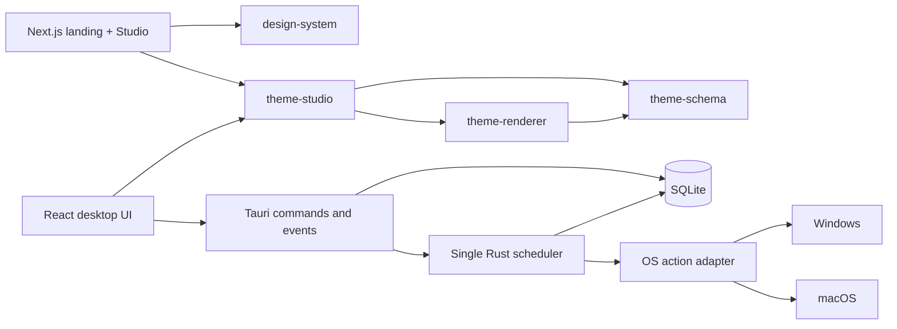

# Architecture

This document describes the code that exists in the repository and labels future services explicitly.

## Current system

In words: web and desktop share the editor, schema, renderer, and design system. Only the Tauri desktop boundary can reach the local database, scheduler, tray, overlay window, or operating-system actions.

## Monorepo responsibilities

| Path | Responsibility |
| --- | --- |
| `apps/desktop` | Vite/React UI, typed Tauri bridge, overlay UI, tray/native Rust code, SQLite |
| `apps/web` | Static bilingual landing and browser Studio routes through Next.js App Router |
| `packages/design-system` | Color, typography, spacing, border, shadow, focus, and motion tokens |
| `packages/theme-schema` | Strict `ThemeManifestV1`, Studio fields, resource limits, bundled themes |
| `packages/theme-renderer` | Digital, analog, flip, word, hybrid clocks and declarative layers |
| `packages/theme-studio` | Shared editor state, undo/redo, scoped keyboard commands, canvas controls, draft storage, JSON I/O |

## Scheduler and persistence

SQLite stores schedules, settings, and audit events in the Tauri app data directory. Rust owns one asynchronous scheduler task. Mutations notify that task; it sleeps until the nearest warning/deadline (bounded to re-evaluate periodically) rather than starting one interval per schedule.

The displayed countdown is always derived from `scheduledFor - now`. Pausing records the remaining duration, resuming creates a new deadline, and snoozing moves that deadline. On startup, a schedule overdue beyond the tolerance becomes `awaiting_confirmation`; recovery never calls the action adapter automatically.

Simulation is persisted locally and defaults to enabled. The Windows/macOS adapters are selected at compile time. Linux deliberately exposes reminder-only capabilities in this milestone.

## Windows and surfaces

- `main`: scheduler and Theme Studio.
- `overlay`: transparent, always-on-top clock with +5, pause/resume, and cancel.
- `tray`: open main, show overlay, +5, pause/resume, cancel, and explicit quit.

Closing the main window hides it. The Rust scheduler remains authoritative while rendering surfaces are hidden.

## Theme data path

`ThemeManifestV1` is data, not an extension runtime. Studio edits the same manifest that the renderer consumes. JSON import is parsed through Zod before entering editor state. The current manifest can express approved clock/layout/palette/effect fields and bounded text/sticker/icon layers; it cannot express arbitrary code, URLs, CSS, HTML, or system actions.

## Planned API boundary

The shared API is **planned, not implemented**. The intended split is:

- Fastify/TypeScript: authentication, authorization, theme publishing, moderation, community, marketplace, and admin endpoints.
- PostgreSQL: users, versions, follows, comments, orders, entitlements, fee snapshots, refunds, settlement, configuration, and audit history.
- S3-compatible storage: validated theme assets and derived previews.
- OpenAPI-generated client: typed web/desktop access without copying request contracts.

Public content will use CDN/cache plus pagination. User mutations use ordinary request/response and explicit cache invalidation. SSE/WebSocket will be added only for a feature that needs continuous server updates; countdowns never require it. Financial rules and paid-theme ownership stay on the backend.

The proposed identity boundary uses an internal stable `user_id` and an OIDC adapter. Web sessions use server-set secure cookies; the public desktop client uses the system browser with Authorization Code + PKCE and stores credentials in an operating-system secure store. The provider is deliberately not selected until the [identity proof gate](adr/0002-identity-provider.md) passes. A session transition can change sync availability, but never scheduler state.

Planned API domains are `identity`, `themes`, `community`, `commerce`, `admin`, and internal `crm`. Queue workers handle asset canonicalization, email, and payment webhooks with retry and idempotency. External CRM tenants remain out of scope until tenant isolation tests pass.

## Offline boundary

The desktop scheduler, database, installed themes, overlay, tray, and simulation work without the API. Login will be required later only for sync, publishing, community interaction, purchases, and store management. A website outage must not stop or change a local schedule.

## Related decisions

- [Ordered implementation plan](implementation-plan.md)
- [Theme Studio feature matrix](theme-studio-feature-matrix.md)
- [Canvas/rendering ADR](adr/0001-theme-canvas-rendering.md)
- [Identity provider ADR](adr/0002-identity-provider.md)
- [Authorization matrix](authorization-matrix.md)
- [Planned server data model](data-model.md)
