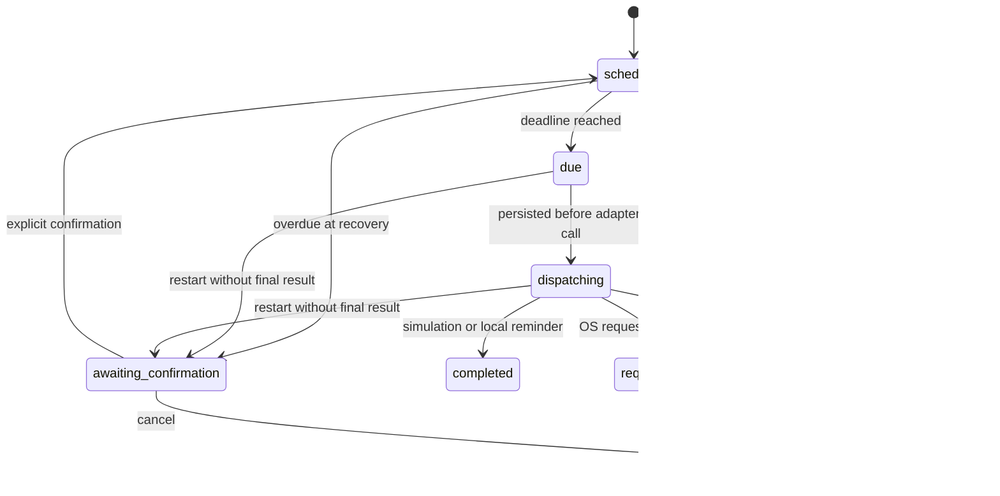

# Scheduler and overlay lifecycle

This document records the fix for the desktop defect where a due Sleep schedule briefly rendered `No active schedule` and the floating window then disappeared.

## Root cause

The screenshots were consistent with the pre-fix source. After dispatch, Rust changed the schedule to `completed` or `failed`. It then emitted `schedule://changed` by querying `active_schedule`, whose SQL only returned open states. The query therefore returned `null`, and the overlay rendered the raw fallback `No active schedule`. The overlay had no listener for `schedule://action-result`, so it could not retain or explain the terminal result. Theme selection was also React state local to each webview, which explains a main-window theme and overlay theme disagreeing.

The simulation checkbox was not inverted: checked sends `enabled: true`, Rust stores `true`, and every schedule snapshots that value at creation. The UI now spells out whether the current schedule is simulated; changing the toggle affects the next schedule, not an already-running one.

The platform adapter used `Command::spawn`. A successful return means only that the operating-system request process started. It is not proof that Sleep/shutdown completed. The previous `completed` label did not preserve this distinction.

## Durable state machine



`due` and `dispatching` are written to SQLite before the adapter runs. If Horune restarts in either state, it changes the record to `awaiting_confirmation`; it never silently sends the system action a second time. Terminal records keep `finished_at`, `result_kind`, `result_detail`, and optional `wake_observed_at` fields and remain visible in local history.

The event order for one identifier is:

```text
create_schedule -> SQLite -> scheduler wake -> warning/due -> dispatching persisted
-> simulation or OS adapter -> terminal record persisted -> action-result event
-> terminal schedule event -> main + overlay + history
```

`schedule://changed` now carries the exact mutated record instead of re-querying only an active record. The `schedule://action-result` payload also carries `scheduleId`, status, result kind, detail, simulation flag, and timestamp.

## Native Sleep result semantics

- `sleep_request_started`: the request process started successfully and the schedule becomes `request_sent`; this is dispatch acknowledgement only, not an OS success acknowledgement.
- `action_failed`: the request could not be started; the overlay remains visible and links to details.
- `wake_observed_at`: set only when the same running Horune process had a pending Sleep request and receives the Tauri `Resumed` lifecycle event.
- A restart cannot claim that wake was observed, because the in-memory pending marker is intentionally lost.

Real Sleep, shutdown, and lock were not invoked by automated tests or during this change. Physical Windows and macOS confirmation remains required.

## Overlay behavior

- A successful simulation shows `Completed in simulation mode` before optional auto-hide.
- An accepted native request shows `Request sent to the operating system`; it does not claim the machine slept or resumed.
- Failures and overdue recovery remain visible and require an explicit user action.
- Cancellation follows the auto-hide preference, while the history record remains.
- Opening the overlay without a schedule shows the Horune icon and a neutral empty state, never the former raw error string.
- Auto-hide defaults on and hides only the overlay window. It never exits Horune or deletes history.

Overlay visibility, control timeout, icon/clock mode, always-on-top, motion, selected theme, and the validated custom manifest are persisted in SQLite. Position, physical size, and scale factor are restored and clamped to an available monitor. Home restores/focuses the main window; pin/unpin updates the native window; corner handles call Tauri's native resize API.

The Tauri window and `html`, `body`, and root surfaces are transparent. A theme may still draw its own bounded face. Browser preview confirms transparent computed backgrounds, but only a running native build can prove desktop-through transparency and z-order.

## Verification

TypeScript tests cover terminal presentation, auto-hide policy, native-request wording, invalid/unsupported theme fallback, and validated custom-theme loading. Rust tests use an in-memory database and fake adapter for a five-minute schedule, warning, simulation completion, adapter success/failure, post-wake result classification, and no repeat after interrupted dispatch/restart.

The local Rust linker currently fails before compiling project code because the Windows SDK cannot supply `msvcrt.lib`. CI is therefore the native compilation gate for this change. See [testing.md](testing.md) for the exact command/results and [platform-limitations.md](platform-limitations.md) for hardware verification limits.
